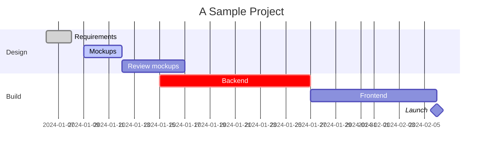

# Project Schedule

Here is the plan:

```mermaid
gantt
    title A Sample Project
    dateFormat  YYYY-MM-DD
    section Design
    Requirements        :done, des1, 2024-01-06, 2024-01-08
    Mockups             :active, des2, 2024-01-09, 3d
    Review mockups      :des3, after des2, 5d
    section Build
    Backend             :crit, b1, 2024-01-15, 12d
    Frontend            :b2, after b1, 10d
    Launch              :milestone, m1, after b2, 0d
```
